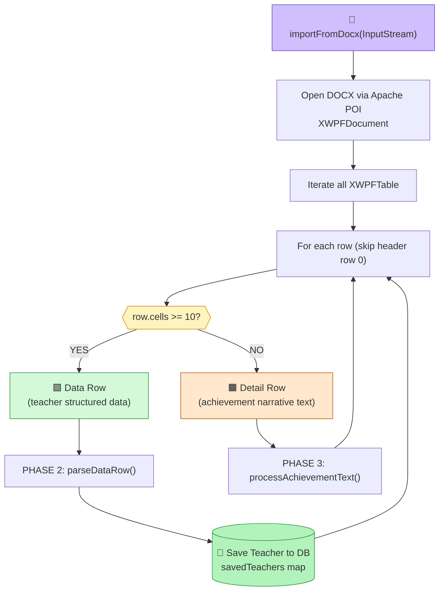
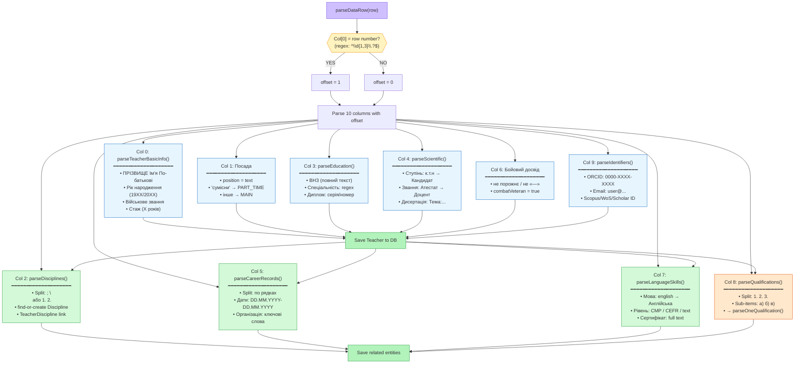
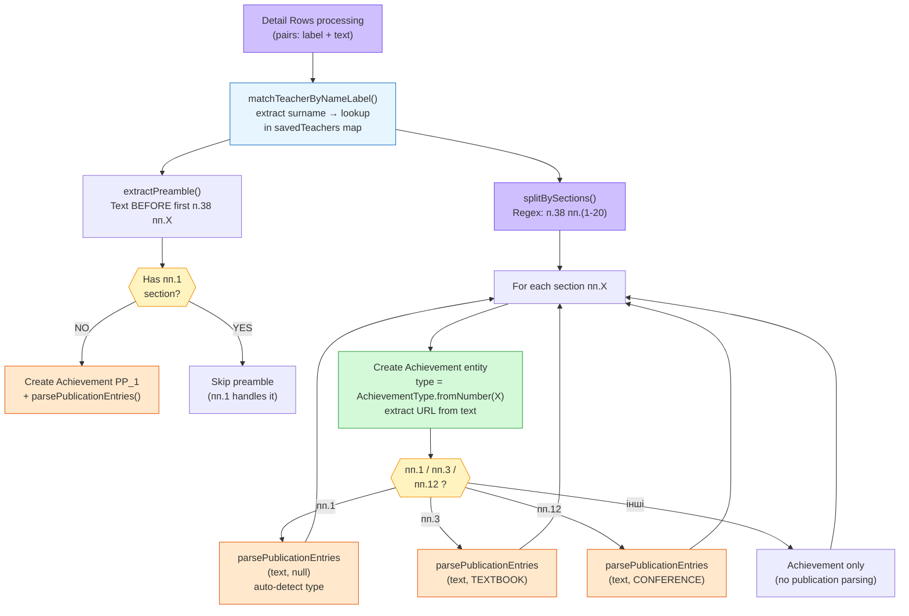
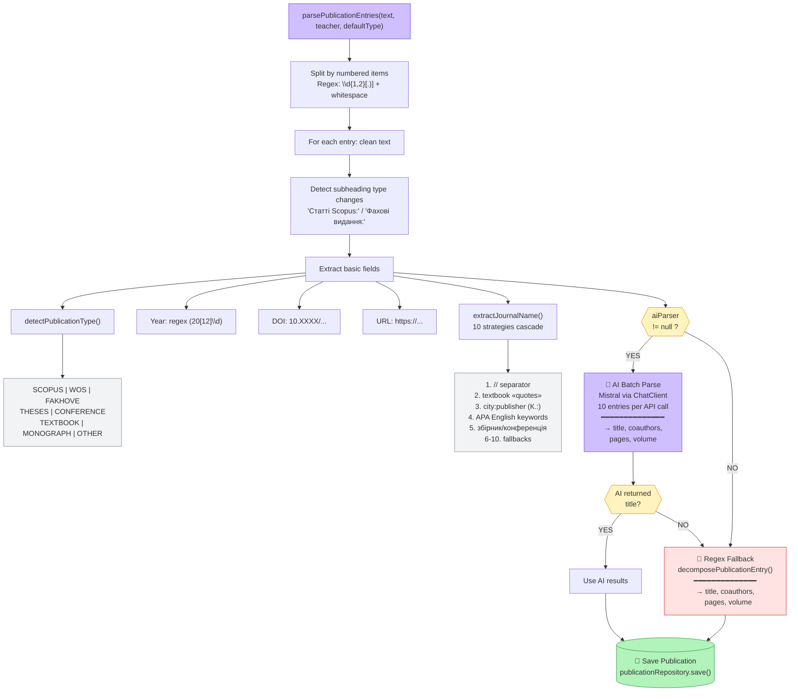
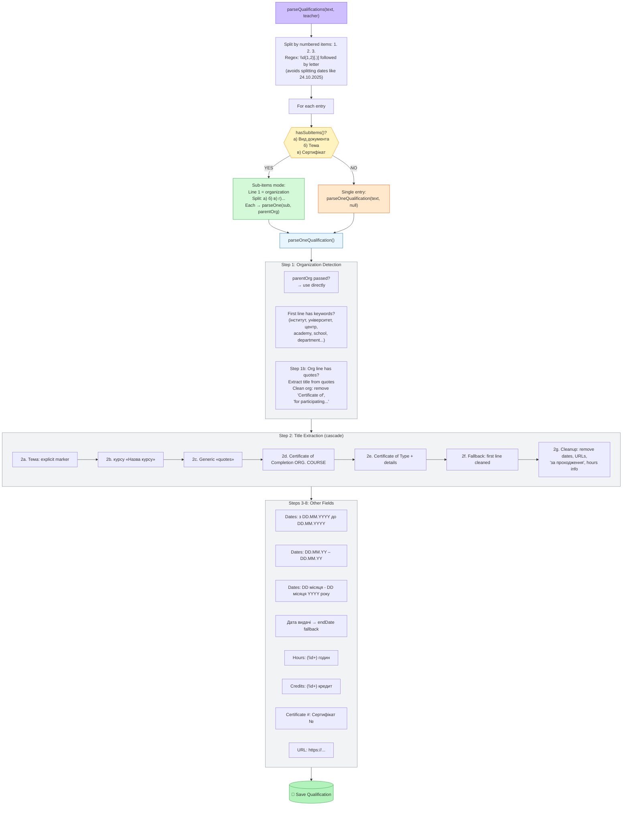
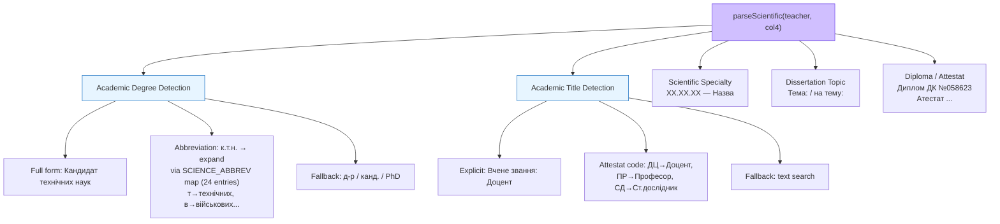
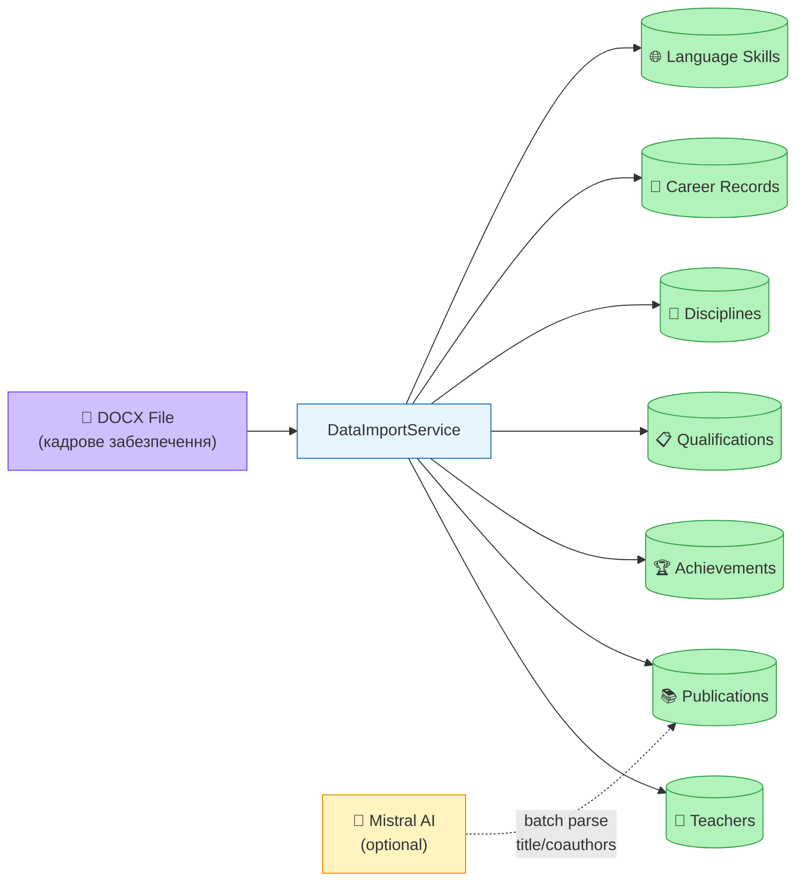

# DOCX Import Algorithm — DataImportService

## Main Flow

## Phase 2: Data Row Column Parsing

## Phase 3: Achievement Text Processing

## Publication Parsing Pipeline

## Qualification Parsing Pipeline

## Scientific Qualification Parsing (Col 4)

## Data Flow Summary

